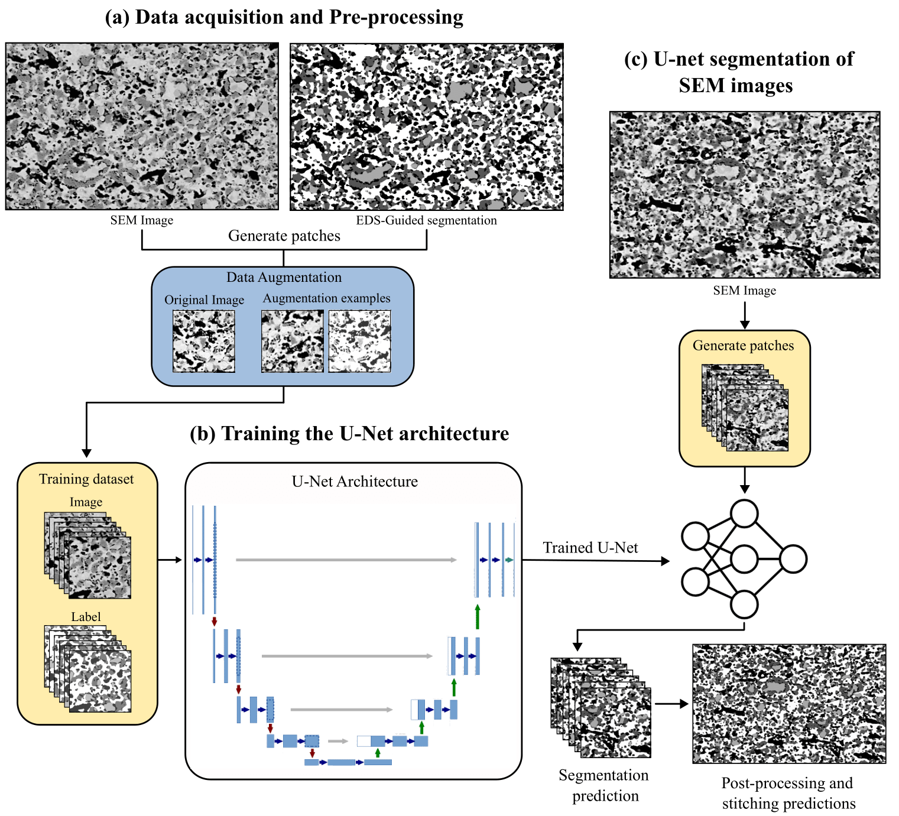

[](https://doi.org/your-doi-link)

# Phase Segmentation of SOC SEM Images using U-Net

This repository implements a deep learning pipeline for **semantic segmentation of Solid Oxide Cell (SOC)** microstructures from **2D SEM images**, without relying on EDS data at inference time.

---

## 🎯 Objective

Accurate phase identification of:

- **Porosity**
- **Metallic Nickel (Ni)**
- **Nickel Oxide (NiO)**
- **Yttria-Stabilized Zirconia (YSZ)**

using **only SEM images**, bypassing time-consuming and equipment-intensive **Energy Dispersive X-ray Spectroscopy (EDS)**.

---

## 🧠 Methodology



**(a) Data Acquisition and Pre-processing**  
SEM and EDS images were acquired from Ni/YSZ hydrogen electrodes of SOCs using a Zeiss Gemini SEM 460 with an Oxford EDS detector.  
EDS maps, collected at lower resolution to reduce drift and acquisition time, were later upsampled and aligned to SEM images via a custom Python script.  
Ground-truth segmentation was generated using *Ilastik*, based on semi-automated annotations.  
To compensate for limited labeled data, 1232 image patches (256×256) were extracted and augmented with transformations, expanding the dataset to 10,920 samples for training.

**(b) Training the U-Net architecture**  
A U-Net model was trained in a supervised manner to classify four key phases: porosity, Ni, NiO, and YSZ.  
Standard cross-entropy loss was used, with data augmentation and tuning strategies enhancing robustness.  
The model learned to accurately predict segmentation maps from raw SEM images—without requiring EDS at inference.

**(c) U-Net segmentation of SEM images**  
Full-size images were segmented using a sliding window approach with overlapping patches.  
Predictions were averaged in overlapping regions to reduce edge artifacts and improve continuity, yielding high-quality, scalable segmentations suitable for automated microstructural analysis.

---

## Publication

This work has been submitted to the journal _Materials and Design_, as a paper entitled “Enhanced Phase Segmentation of Scanning Electron Microscopy Images Using U-Net with Energy Dispersive X-ray Spectroscopy-Guided Labelling“, currently under review.

---

## ⚙️ Requirements

Clone the repository and install dependencies:

```bash
git clone https://github.com/CEA-MetroCarac/SEM_Phases_Segmentation.git
cd SEM_Phases_Segmentation
pip install -r requirements.txt


